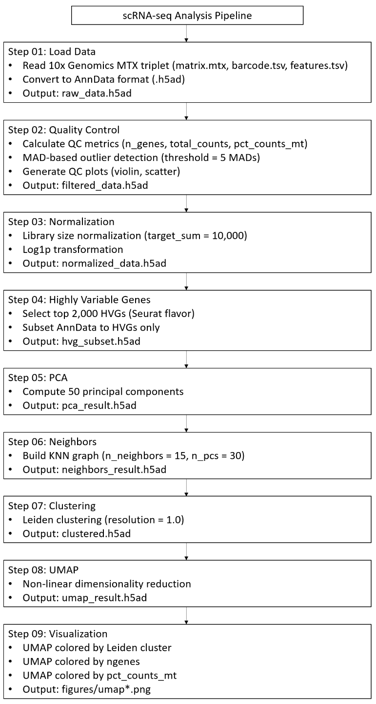
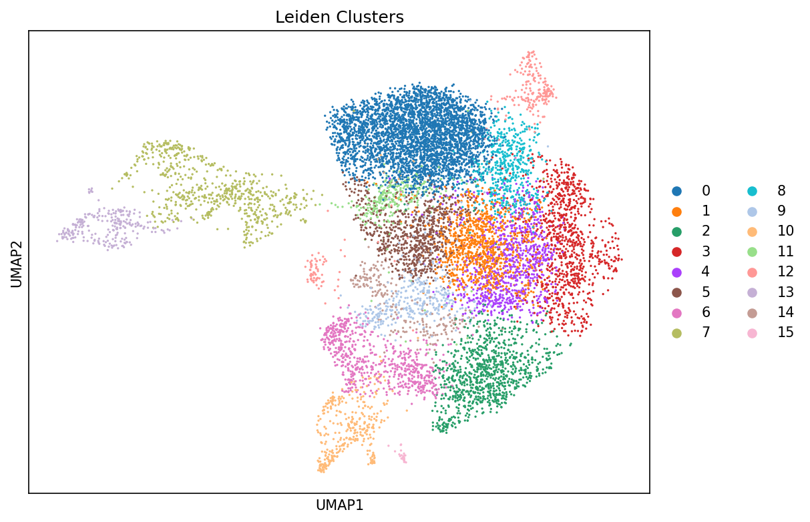
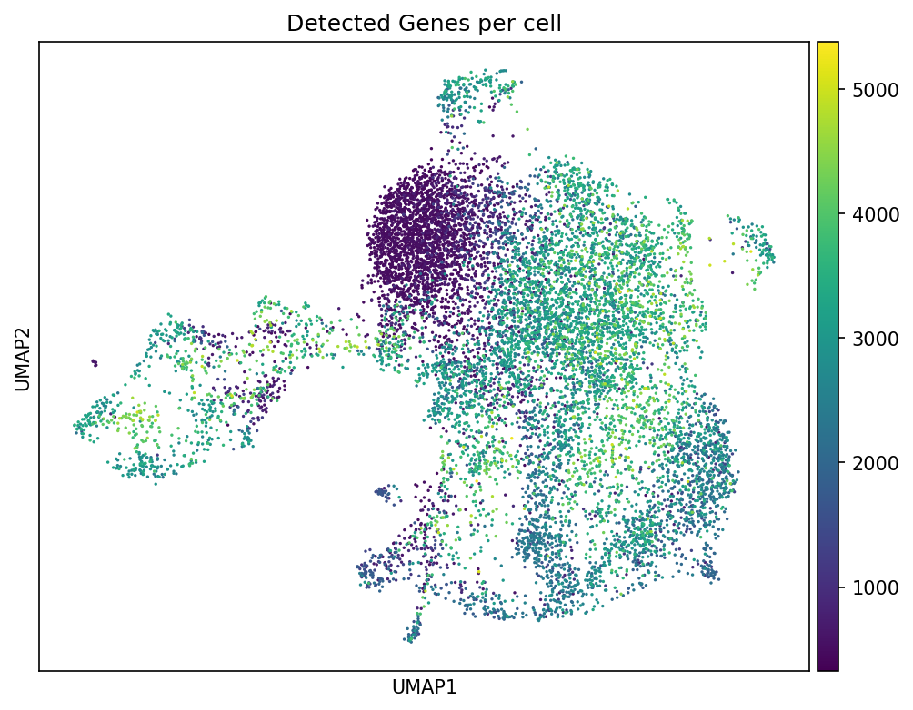
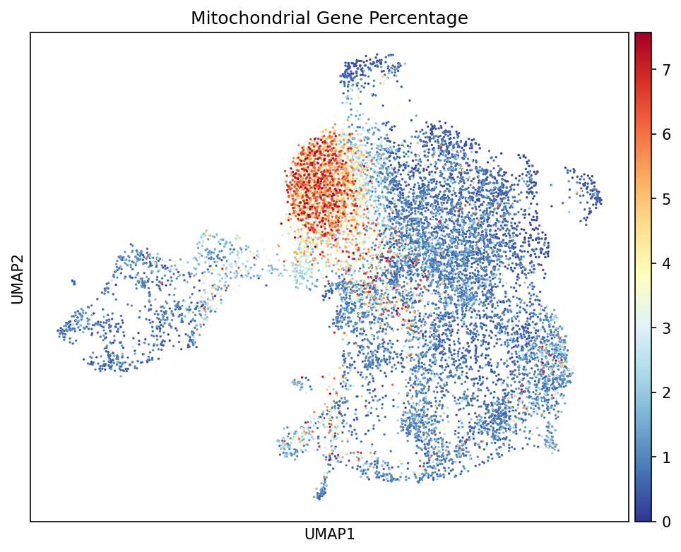

# scRNA-seq Analysis of dlg-Mediated Cell Competition in Drosophila Eye Disc

[](https://www.python.org/downloads/)

单细胞转录组分析流程：果蝇三龄幼虫眼 - 触角盘（eye-antennal disc）细胞竞争模型

---

## 📋 项目背景

### 科学问题

本项目研究 **dlg (discs large)** 介导的细胞竞争机制。细胞竞争是一种细胞间的相互作用过程，其中"winner"细胞通过识别并消除邻近的"loser"细胞来优化组织适应性。

### 样本信息

| 属性        | 描述                                                                            |
| --------- | ----------------------------------------------------------------------------- |
| **物种**    | _Drosophila melanogaster_ (黑腹果蝇)                                              |
| **参考基因组** | FlyBase r6.49                                                                 |
| **组织**    | 三龄幼虫眼 - 触角盘 (eye-antennal disc)                                               |
| **基因型**   | `dlg^{m52},FRT19A/Tubulin-GAL80,FRT19A; eyFLP,Act5C>yellow>GAL4,UAS-GFP/+; +` |
| **细胞类型**  | scrib 型细胞竞争 winner 和 loser 混合细胞群                                              |

### 研究目标

1. 解析 *dlg* 突变诱导的细胞竞争中 winner 和 loser 细胞的转录组特征
2. 探索细胞极性蛋白（dlg, scrib）在单细胞水平的表达模式
3. 鉴定细胞竞争相关的差异表达基因和信号通路

---

## 🗂️ 项目结构

```
scRNAseq_analysis_dlg/
├── config/
│   └── config.yaml          # 集中配置文件（路径、分析参数）
├── scripts/
│   ├── 01_load_data.py      # 加载 10x Genomics 原始数据
│   ├── 02_qc.py             # 质控过滤（MAD 离群值检测+Scrublet双胞过滤）
│   ├── 03_normalization.py  # 标准化和 log 转换
│   ├── 04_variable_genes.py # 高可变基因选择
│   ├── 05_pca.py            # PCA 降维
│   ├── 06_neighbors.py      # 构建 KNN 近邻图
│   ├── 07_clustering.py     # Leiden 聚类
│   ├── 08_umap.py           # UMAP 非线性降维
│   └── 09_plot_umap.py      # UMAP 可视化
├── src/
│   ├── __init__.py
│   └── config.py            # 配置加载模块
├── figures/                 # 输出图表（需手动创建）
│   └── README_fig/
│       ├── violin_before_filter.png
│       ├── scatter_before_filter.png
│       ├── violin_after_filter.png
│       ├── scatter_after_filter.png
│       ├── umap_leiden.png
│       ├── umap_ngenes.png
│       ├── violin_doublet_score.png
│       ├── scRNA_seq_Analysis_Pipeline.png
│       └── umap_mt.png
└── README.md
```

---

## 🚀 快速开始

### 环境要求

- Python 3.9+
- 主要依赖：
  - `scanpy` (单细胞分析)
  - `anndata` (数据结构)
  - `pyyaml` (配置解析)
  - `numpy`, `pandas`, `matplotlib`, `scrublet`

### 安装依赖

```bash
# 创建 conda 环境（推荐）
conda create -n scrna_seq python=3.9
conda activate scrna_seq

# 安装依赖
pip install scanpy anndata pyyaml numpy pandas matplotlib scrublet
```

### 配置

编辑 `config/config.yaml` 文件，设置你的数据路径和参数：

```yaml
paths:
  raw_data_dir: "/path/to/cellranger/output"  # CellRanger 输出目录
  processed_dir: "/path/to/processed_data"    # 中间产物目录
  results_dir: "/path/to/results"             # 最终结果目录
  figures_dir: "/path/to/figures"             # 图表输出目录

params:
  qc:
    mad_thresh: 5          # MAD 离群值阈值
    mt_genes_complete:
      # 果蝇线粒体基因组完整基因列表 (37 个)  
      # 来源：org.Dm.eg.db (CHR=MT)
      - 'FBgn0013703'
      - 'FBgn0013700'
      # ...
```

### 运行流程

按顺序执行所有脚本：

```bash
# 确保在 project root 目录
cd /path/to/scRNAseq_analysis_dlg

# 逐步运行
python scripts/01_load_data.py
python scripts/02_qc.py
python scripts/03_normalization.py
python scripts/04_variable_genes.py
python scripts/05_pca.py
python scripts/06_neighbors.py
python scripts/07_clustering.py
python scripts/08_umap.py
python scripts/09_plot_umap.py
```

或者使用循环一键运行：

```bash
for i in $(seq -w 1 9); do  
    python scripts/${i}_*.py  
done  
```

---

## 📊 分析流程



_图 1：单细胞转录组分析流程_

---

## 📁 输出文件说明

### 中间数据（`processed_dir/`）

| 文件 | 描述 |
|------|------|
| `raw_data.h5ad` | 原始 10x 数据（未过滤） |
| `filtered_data.h5ad` | QC 过滤后的数据 |
| `normalized_data.h5ad` | 标准化 + log 转换后的数据 |
| `hvg_subset.h5ad` | 仅包含高可变基因的数据 |
| `pca_result.h5ad` | PCA 降维后的数据 |
| `neighbors_result.h5ad` | 包含 KNN 图的数据 |
| `clustered.h5ad` | 包含 Leiden 聚类标签的数据 |
| `umap_result.h5ad` | 包含 UMAP 嵌入的数据 |

### 图表（`figures/README_fig/`）

| 文件                          | 描述              |
| --------------------------- | --------------- |
| `violin_before_filter.png`  | QC 指标分布（过滤前）    |
| `scatter_before_filter.png` | QC 指标相关性（过滤前）   |
| `umap_leiden.png`           | UMAP 按聚类着色      |
| `umap_ngenes.png`           | UMAP 按检测基因数着色   |
| `umap_mt.png`               | UMAP 按线粒体基因比例着色 |
| `violin_after_filter.png`   | QC 指标分布（过滤后）    |
| `scatter_after_filter.png`  | QC 指标相关性（过滤后）   |
| `violin_doublet_score.png`  | 双胞得分分布          |

---

## 🎨 初步结果

### UMAP 可视化

_（待添加图表）_


_图 2：Leiden 聚类结果的 UMAP 可视化_

### 质控评估


_图 3：UMAP 按每个细胞检测到的基因数着色_


_图 4：UMAP 按线粒体基因百分比着色_

---

## 🔧 自定义分析

### 修改参数

所有关键参数都在 `config/config.yaml` 中配置：

```yaml
params:
  qc:
    mad_thresh: 5              # 增大阈值 → 保留更多细胞
  normalization:
    target_sum: 10000          # 标准化因子
  hvg:
    n_top_genes: 2000          # 高可变基因数量
  dim_reduction:
    n_pcs: 50                  # PCA 主成分数量
    n_neighbors: 15            # KNN 近邻数
  clustering:
    resolution: 1.0            # Leiden 分辨率（越高→聚类越多）
```

### 添加新分析

探索性分析脚本建议使用 `temp_*.py` 命名，并**不要推送到主分支**：

```bash
# 示例：基因表达可视化
python temp_plot_gene_expression.py
```

---

## 📝 后续计划

- [ ] **细胞类型注释**：使用已知 marker 基因鉴定细胞类型
- [ ] **差异表达分析**：比较不同聚类群之间的 DEG
- [ ] **通路富集分析**：GO/KEGG 富集分析
- [ ] **细胞竞争 marker 探索**：分析 dlg、scrib、JNK 通路基因表达模式
- [ ] **拟时序分析**：使用 PAGA 或 Monocle3 推断细胞状态转变
- [ ] **细胞间通讯分析**：使用 CellChat 或 CellPhoneDB

---

## 📚 参考资料

- **Scanpy 文档**: https://scanpy.readthedocs.io/
- **10x Genomics 分析流程**: https://support.10xgenomics.com/single-cell-gene-expression/software/pipelines/latest/what-is-cell-ranger
- **果蝇基因组**: https://flybase.org/
- **细胞竞争综述**: 
  - Nagata R.,  et al. (2019). Cell Competition Is Driven by Autophagy. *Developmental Cell*, 51 (1), 1-14
  - Fahey-Lozano N., et al. (2019). *Drosophila* Models of Cell Polarity and Cell Competition in Tumourigenesis. *Advances in Experimental Medicine and Biology*, 1167: 37-64

---
## 👤 作者

**ChangeJam**

如有问题或建议，欢迎通过 GitHub Issues 联系。

---

<div align="center">

**最后更新**: 2026-04-28

</div>
